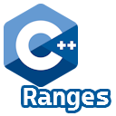

#  for Unreal
# IGRanges: C++ Ranges for Unreal
 
 

**IGRanges** is an Unreal Engine 5 plugin that leverages the [Ranges library (C++20)](https://en.cppreference.com/w/cpp/ranges) to provide [LINQ (C#)](https://learn.microsoft.com/en-us/dotnet/csharp/linq/) style code patterns.

----

## C++ Ranges for Unreal

Bacon ipsum dolor amet jowl landjaeger burgdoggen bacon ribeye, tenderloin salami tri-tip pork pork belly short loin ham hock filet mignon frankfurter. Andouille hamburger short loin sirloin corned beef ham hock turducken pork belly burgdoggen pork ham short ribs pig ground round. Pancetta chislic ribeye bresaola hamburger ham hock jerky. Swine doner venison, prosciutto pork chop fatback tri-tip meatball filet mignon bacon pork short loin turkey shoulder. Picanha sausage tail bacon landjaeger boudin chuck. Leberkas short ribs swine, frankfurter jerky meatloaf porchetta.

### Think LINQ (C#)

Bacon ipsum dolor amet tempor ex venison tongue, cillum sausage sunt prosciutto. Flank ut beef quis, commodo et eiusmod. Meatloaf ut landjaeger fugiat bacon esse tail reprehenderit ribeye kielbasa pariatur incididunt meatball velit mollit. Andouille in officia adipisicing short loin aliquip velit aute swine ut pork chop boudin deserunt. In porchetta sunt nisi commodo tail anim ullamco sed non beef ribs ipsum minim. Irure quis ham hock dolor, capicola minim pork chop biltong tempor sunt shank strip steak.

----

### ✨ Features

- `Where`, `WhereNot`
- `NonNull`, `NonNullRef`
- `Select`
- `OfType<T>`, `OfTypeRef<T>`
- `FirstOrDefault`
- `Count`
- `ToArray`
- `ToSet`

----

### 🔗 Related Links

- [Ranges library (C++20)](https://en.cppreference.com/w/cpp/ranges)
- [\<ranges\> | Microsoft Learn](https://learn.microsoft.com/en-us/cpp/standard-library/ranges)
- [Language Integrated Query (LINQ) - C# | Microsoft Learn](https://learn.microsoft.com/en-us/dotnet/csharp/linq/)
